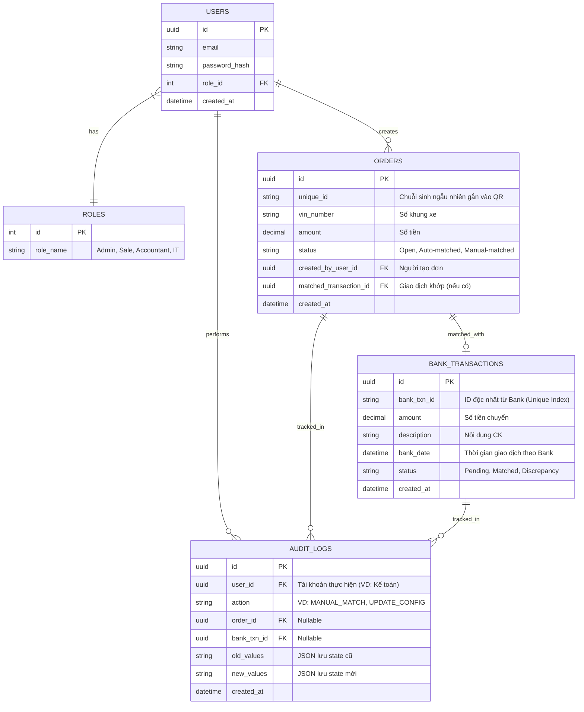

# Tài liệu Thiết kế Phần mềm (Software Design Document)

## Dự án: Hệ thống Quản lý Đơn hàng và Đối soát Tự động

### 1. Phân tích Yêu cầu (Requirement Analysis)
- Tự động hóa quy trình quản lý đơn hàng và đối soát (reconciliation).
- Thu thập dữ liệu giao dịch ngân hàng qua API (cronjob 3 phút/lần).
- Khớp lệnh tự động giữa đơn hàng và giao dịch.
- Xuất dữ liệu định kỳ cho hệ thống Pinewood.

### 2. Thiết kế Kiến trúc (Architectural Design)
Hệ thống được thiết kế theo mô hình **Client-Server** với các công nghệ sau:
- **Backend (API & Cronjob)**: **Golang (Go)**. Go là lựa chọn tuyệt vời đối với dự án này nhờ khả năng xử lý đồng thời (concurrency) vượt trội với thẻ *Goroutines*, cực kì tối ưu cho việc chạy tác vụ nền (cronjob) theo thời gian thực để thu thập dữ liệu từ API Ngân hàng và xử lý lượng lớn dữ liệu giao dịch trong tíc tắc với độ trễ cực thấp.
- **Database (Cơ sở dữ liệu chính)**: **PostgreSQL**. Là lõi của hệ thống tài chính, PostgreSQL đảm bảo tính toàn vẹn dữ liệu cực tốt (chuẩn ACID), cho phép tạo các transaction database mạnh mẽ (khi kế toán khớp lệnh, đảm bảo lưu thành công đồng bộ 100% hoặc cuộn lại toàn bộ, không có chuyện khớp một nửa).
- **In-memory Cache & Lock**: **Redis**. Sử dụng để xử lý Distributed Lock chặn đụng độ (race-condition) giữa các cronjob và quản lý tốc độ/thời gian sống (TTL) của các phiên đăng nhập bảo mật.
- **Frontend**: **React**. Xây dựng giao diện Single Page Application (SPA) mượt mà cho Dashboard và màn hình đối soát để Kế toán thao tác kéo/thả không bị giật lag.

### 3. Thiết kế Dữ liệu (Database Design)

Dưới đây là Sơ đồ thực thể liên kết (ERD Diagram) mô tả các bảng (table) và mối quan hệ giữa chúng trong cơ sở dữ liệu của dự án. 
*(Sơ đồ này sẽ được render thành hình ảnh ngay trên màn hình của bạn)*

**Các ràng buộc/index quan trọng cho DB:**
- Bảng **`Users`**: Cột `password` phải được mã hoá bcrypt.
- Bảng **`Orders`**: Có Unique Index lên biến `unique_id` để lúc gen QR không báo lỗi.
- Bảng **`BankTransactions`**: **Đánh Unique Index** vào cột `bank_txn_id` (mã giao dịch trả về từ ngân hàng). Nếu Cronjob lấy nhầm hoặc lấy trùng, Postgres sẽ ném lỗi và tự Drop record, giúp xoá hoàn toàn 100% lỗi ăn gian/Duplicate dữ liệu.
- Bảng **`AuditLogs`**: Các cột `old_values` và `new_values` nên để dạng `JSONB` để kế toán dễ debug thay đổi.

### 4. Thiết kế Giao diện người dùng (UI/UX Design)
- **Dashboard**: Thống kê số tiền về, số tiền treo, tỷ lệ auto-match thành công.
- **Màn hình Đơn hàng (Dành cho Sale)**: Nhập thông tin, tạo đơn và sinh QR (hiển thị mã VietQR).
- **Giao diện Đối soát Kế toán (Dành cho Account)**:
  - Tab "Chờ xử lý thủ công" (Pending Manual Review). Liệt kê các BankTransactions không auto-match được.
  - Component mapping kéo thả/danh sách dropdown thông minh để Kế toán chọn một Giao dịch gán vào Đơn tương ứng.
- **Cấu hình & Export**: Màn hình tải file CSV/Excel map với biểu mẫu Pinewood.

### 5. Thiết kế Chi tiết (Detailed Design)

#### 5.1. Thiết kế Danh sách API (API Endpoints Specs)
Dưới đây là tập hợp các RESTful APIs chuẩn cần thiết cho các thao tác của Frontend và hệ thống:

**Auth & Access:**
- `POST /api/v1/auth/login`: Xác thực và trả về JWT token.

**Order Management (Quản lý đơn):**
- `GET /api/v1/orders`: Lấy danh sách đơn hàng (Có filter theo trạng thái: Open, Matched).
- `POST /api/v1/orders`: Sale tạo đơn mới. Backend tự sinh `Unique_ID` và nội dung VietQR trả về cho Frontend.

**Bank Transactions & Sync:**
- `POST /api/v1/transactions/sync`: Trigger cronjob lấy dữ liệu báo có thủ công (phòng hờ trường hợp chạy tự động lỗi và muốn sync liền).
- `GET /api/v1/transactions/pending`: Lấy danh sách các giao dịch "Chờ xử lý thủ công" (Không khớp tự động được).

**Reconciliation (Đối soát thủ công):**
- `POST /api/v1/reconciliation/match`: Kế toán gửi cục data chứa `Order_ID` và `Bank_Transaction_ID`. Backend thực hiện mapping 2 cái này, đổi trạng thái và bắn log vào Audit.

**Export:**
- `GET /api/v1/export/pinewood`: Cung cấp đường dẫn hoặc luồng stream file để tải xuống cục CSV/Excel form chuẩn của Pinewood với các đơn đã được Matched.

#### 5.2. Logic Các Module Cốt Lõi
- **Module GenQR**: Tích hợp chuẩn **VietQR**. Nội dung chuyển khoản mặc định: `[PREFIX] <Unique_ID_Đơn_Hàng>` (ví dụ: `PAY AUTO5C ORD-A719`). Mã sẽ tự map số tiền và nội dung, Sales chỉ việc chìa ra cho khách quét.
- **Module Bank API Ingestion**: Cronjob Go chạy ngầm 3 phút. 
  - **Cơ chế Distributed Lock (với Redis)**: Trước khi chạy lấy dữ liệu từ Bank, Cronjob phải set 1 cái Mutex Lock vào Redis. Giả sử mạng lag làm Cronjob trước kẹt quá 3 phút chưa xong, thì khi Cronjob tiếp theo được gọi lên, nó sẽ thấy "À có Lock trong Redis rồi" nên nó sẽ bỏ qua, chặn đứng nguy cơ gọi Bank lần 2 làm lặp dữ liệu.
  - **Cơ chế Backfill**: Query dữ liệu từ `thời_điểm_chạy_thành_công_gần_nhất` tính đến giây phút hiện tại thay vì -3 phút tĩnh. File log hệ thống nếu lỗi Bank quá 3 lần -> Bắn webhook lên Telegram Group.
- **Thuật toán Khớp lệnh (Auto-matching)**:
  - *Ưu tiên 1*: Regex quét nội dung chuyển khoản xem có chứa `ORD-[A-Z0-9]+`. Nếu tra DB ra ID này -> Tự động khớp.
  - *Ưu tiên 2*: Filter `Amount`. Nếu số tiền khớp đúng với **chỉ 1 đơn duy nhất** đang đợi -> Khớp.
  - *Fallback*: Nếu có **>= 2 đơn hàng** cùng số tiền -> Bỏ qua, để nguyên trạng thái "Pending" cho Giao dịch. Nó sẽ báo đỏ trên màn hình của Kế toán.

---
*Đây là phiên bản đầy đủ của Tài Liệu Thiết Kế Phần Mềm (Software Design Document). Team Development có thể sử dụng trực tiếp tài liệu này để bắt tay vào triển khai dự án cấu trúc Backend Golang, setup PostgreSQL và Frontend React.*
