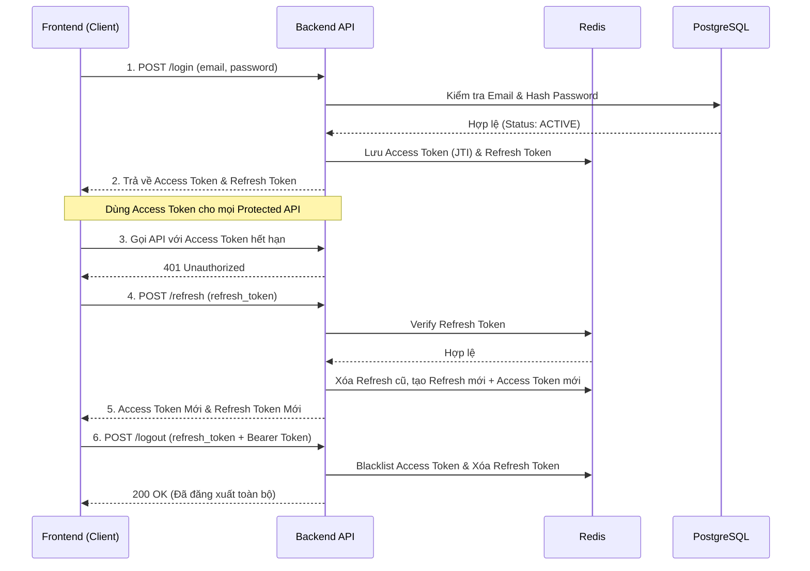
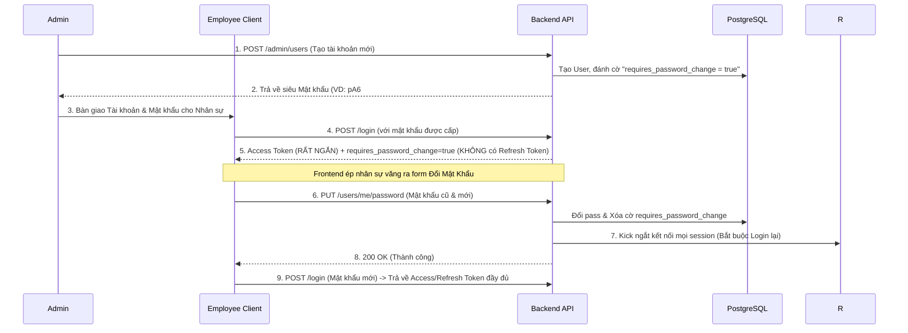

# Tài Liệu API & Logic Flow: Xác Thực & Quản Lý Người Dùng

Tài liệu này mô tả chi tiết các API và quy trình nghiệp vụ (Flow) liên quan đến Authentication, thao tác của Cá nhân (lấy Profile, đổi mật khẩu) và Quản lý người dùng của role Admin.

---

## 0. Quy Tắc Phân Quyền & Role (RBAC)

Hệ thống được bảo vệ qua 2 lớp Authentication (Xác thực) và Authorization (Phân quyền):
1. **Public Routes**: Có thể gọi mà không cần token.
2. **Protected Routes (Mọi User)**: Yêu cầu request phải có thẻ `Authorization: Bearer <access_token>` trong phần Request Headers. Token phải hợp lệ và chưa hết hạn.
3. **Admin-Only Routes**: Yêu cầu token hợp lệ VÀ quyền của tài khoản gọi API phải là `role_id = 1` (Admin).

---

## 1. Flow Nghiệp Vụ (Business Logic Flows)

### 1.1. Luồng Xác Thực (Auth & Token Lifecycle Flow)

Biểu đồ mô tả vòng đời của Token từ khi đăng nhập, xin cấp lại token mới đến khi đăng xuất:



### 1.2. Luồng Cấp Phát Tài Khoản (Provisioning & Force Change Password)

Vì hệ thống không có luồng "Quên mật khẩu" tự động phục vụ Public, nhân viên khi vào công ty hoặc quên pass sẽ được Admin xử lý như sau:



---

## 2. API: Luồng Xác Thực (Authentication)

### 2.1. Đăng nhập (Login)
- **Endpoint**: `POST /api/v1/auth/login`
- **Headers**: Không yêu cầu (Public Route)
- **Mô tả**: Lấy Token khởi tạo phiên đăng nhập.
- **Request Body**:
  ```json
  {
    "email": "sale01@company.com",
    "password": "Mypassword@123"
  }
  ```
- **Response (200 OK - Bình thường)**:
  ```json
  {
    "status": "success",
    "data": {
      "access_token": "eyJhbG...",
      "refresh_token": "uuid-string-4321",
      "requires_password_change": false
    }
  }
  ```
- **Response (200 OK - Cấp mới / Admin Force Change Pass)**: Không trả `refresh_token` để ép user đổi pass.
  ```json
  {
    "status": "success",
    "data": {
      "access_token": "eyJhbG...",
      "requires_password_change": true
    }
  }
  ```

### 2.2. Làm mới Token (Refresh Token)
- **Endpoint**: `POST /api/v1/auth/refresh`
- **Headers**: Không yêu cầu (Public Route)
- **Mô tả**: Xin cấp Access Token mới (và quay vòng Refresh Token mới).
- **Request Body**:
  ```json
  {
    "refresh_token": "uuid-string-4321"
  }
  ```
- **Response (200 OK)**:
  ```json
  {
    "status": "success",
    "data": {
      "access_token": "eyJhbG...mới",
      "refresh_token": "uuid-string-mới"
    }
  }
  ```

### 2.3. Đăng xuất (Logout)
- **Endpoint**: `POST /api/v1/auth/logout`
- **Headers**: `Authorization: Bearer <access_token>` (Bắt buộc)
- **Mô tả**: Đưa `access_token` vào Blacklist và thu hồi `refresh_token`.
- **Request Body**:
  ```json
  {
    "refresh_token": "uuid-string-4321"
  }
  ```

---

## 3. API: Quản Lý Cá Nhân (Personal Flow)

### 3.1. Lấy thông tin Profile
- **Endpoint**: `GET /api/v1/users/me`
- **Headers**: `Authorization: Bearer <access_token>` (Bắt buộc)
- **Mô tả**: Dùng để vẽ UI khi user load lại web.
- **Response (200 OK)**:
  ```json
  {
    "status": "success",
    "data": {
      "user_id": "uuid-string",
      "email": "sale01@company.com",
      "full_name": "Nguyễn Văn A",
      "role": "SALE"
    }
  }
  ```

### 3.2. Đổi mật khẩu cá nhân
- **Endpoint**: `PUT /api/v1/users/me/password`
- **Headers**: `Authorization: Bearer <access_token>` (Bắt buộc)
- **Mô tả**: Gỡ cờ `requires_password_change` và ép Logout tất cả mọi thiết bị (xóa Redis session).
- **Request Body**:
  ```json
  {
    "old_password": "Company@123",
    "new_password": "MySecretPassword@999"
  }
  ```

---

## 4. API: Quản Lý Người Dùng (Admin Flow - Admin Only)

### 4.1. Cấp Mới Tài Khoản
- **Endpoint**: `POST /api/v1/admin/users`
- **Headers**: `Authorization: Bearer <access_token>` (Bắt buộc - Phân quyền Admin)
- **Mô tả**: Backend tự random Mật khẩu bảo mật và giới hạn quyền sử dụng (yêu cầu đổi pass).
- **Request Body**:
  ```json
  {
    "full_name": "Nguyễn Văn B",
    "email": "sale02@company.com",
    "role_id": 2
  }
  ```
- **Response (201 Created)**: (Return Mật khẩu độc nhất 1 lần để Admin gửi Nhân viên).
  ```json
  {
    "status": "success",
    "data": {
      "user_id": "uuid",
      "email": "sale02@company.com",
      "default_password": "pA6#9!lKz2@W" 
    }
  }
  ```

### 4.2. Lấy Danh Sách User
- **Endpoint**: `GET /api/v1/admin/users`
- **Headers**: `Authorization: Bearer <access_token>` (Bắt buộc - Phân quyền Admin)
- **Truy vấn**: `?role=SALE`, `?status=INACTIVE` (Tùy chọn)

### 4.3. Khoá / Mở Khoá Tài Khoản
- **Endpoint**: `PUT /api/v1/admin/users/:id/status`
- **Headers**: `Authorization: Bearer <access_token>` (Bắt buộc - Phân quyền Admin)
- **Mô tả**: Khoá (`INACTIVE`) sẽ thu hồi tức khắc dòng đời token trên Redis, ép văng kết nối hiện tại.
- **Request Body**:
  ```json
  {
    "status": "INACTIVE" 
  }
  ```
