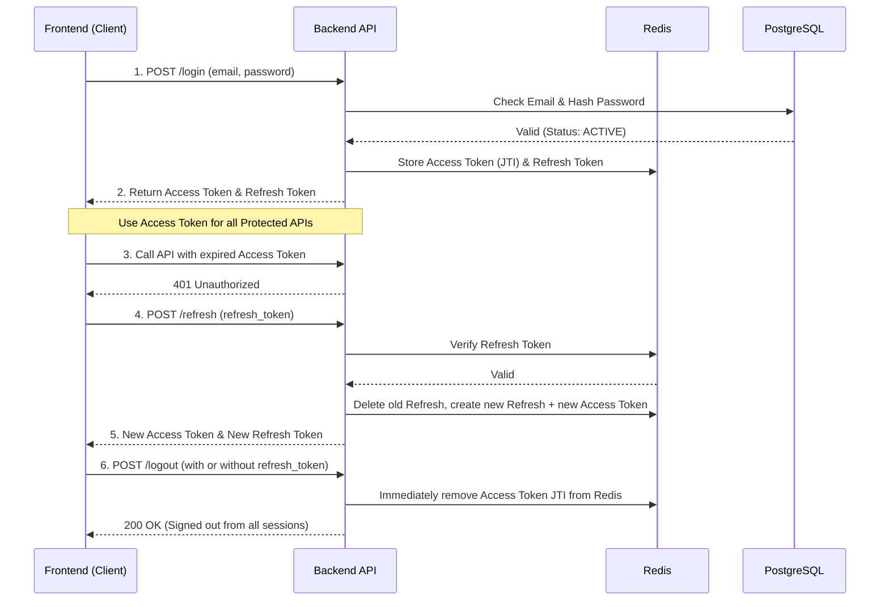
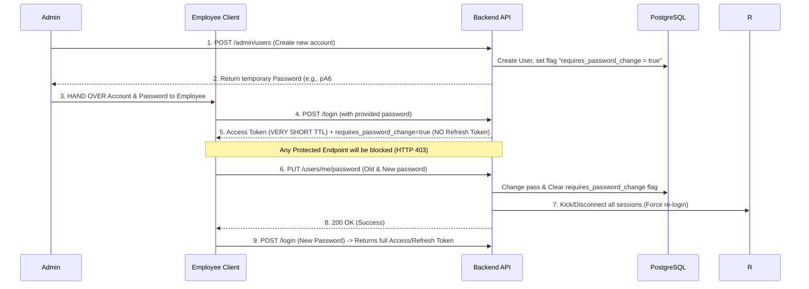

# API Documentation & Logic Flow: Authentication & User Management

This document details the APIs and business logic flows related to Authentication, Personal operations (Profile, Password change), and Admin-role User Management.

---

## 0. Role-Based Access Control (RBAC) Rules

The system is protected by two layers: Authentication and Authorization.
1. **Public Routes**: Accessible without a token.
2. **Protected Routes (All Users)**: Requires a `Authorization: Bearer <access_token>` in the Request Headers. The token must be valid and active in Redis.
3. **Admin-Only Routes**: Requires a valid token AND the account's role must be `role_id = 1` (Admin).

### 0.1 Authentication Error Handling (Middleware)
The Frontend should handle the following HTTP Error Codes for appropriate UI responses:
- **`401 Unauthorized`**: Token expired, invalid, OR removed from Redis (Revoked by Admin or session termination due to password change).
  - *Frontend Action:* Clear all tokens from LocalStorage/Cookies and redirect to the Login page.
- **`403 Forbidden` (Password change required)**: When a user has the `requires_password_change` flag set, any API call (except the password change API) will return this error.
  - *Frontend Action:* Redirect user to the "Force Password Change" page and block other UI interactions.
- **`503 Service Unavailable`**: Redis connection issue, system cannot safely authenticate sessions (Fail-closed policy).
  - *Frontend Action:* Show a maintenance message, DO NOT automatically logout the user.

---

## 1. Business Logic Flows

### 1.1. Auth & Token Lifecycle Flow

This diagram describes the Token lifecycle from login and refreshing to logout:



### 1.2. Account Provisioning & Force Password Change Flow

Since the system does not have a public "Forgot Password" flow, employees or those who forget their password will be handled by the Admin:



---

## 2. API: Authentication

### 2.1. Login
- **Endpoint**: `POST /api/v1/auth/login`
- **Headers**: None (Public Route)
- **Description**: Obtain tokens to initialize a login session.
- **Request Body**:
  ```json
  {
    "email": "sale01@company.com",
    "password": "Mypassword@123"
  }
  ```
- **Response (200 OK - Normal)**:
  ```json
  {
    "status": "success",
    "data": {
      "access_token": "eyJhbG...",
      "refresh_token": "uuid-string-4321",
      "requires_password_change": false
    }
  }
  ```
- **Response (200 OK - New Account / Admin Force Change Pass)**: `refresh_token` is NOT returned to force the user to change their password immediately.
  ```json
  {
    "status": "success",
    "data": {
      "access_token": "eyJhbG...",
      "requires_password_change": true
    }
  }
  ```

### 2.2. Refresh Token
- **Endpoint**: `POST /api/v1/auth/refresh`
- **Headers**: None (Public Route)
- **Description**: Request a new Access Token (and rotate the Refresh Token).
- **Request Body**:
  ```json
  {
    "refresh_token": "uuid-string-4321"
  }
  ```
- **Response (200 OK)**:
  ```json
  {
    "status": "success",
    "data": {
      "access_token": "new-eyJhbG...",
      "refresh_token": "new-uuid-string"
    }
  }
  ```

### 2.3. Logout
- **Endpoint**: `POST /api/v1/auth/logout`
- **Headers**: `Authorization: Bearer <access_token>` (Required)
- **Description**: Remove the Access Token session from Redis. If a Refresh Token is provided, it will also be deleted.
- **Request Body**:
  ```json
  {
    "refresh_token": "uuid-string-4321" // Optional
  }
  ```

---

## 3. API: Personal Management

### 3.1. Get Profile Information
- **Endpoint**: `GET /api/v1/users/me`
- **Headers**: `Authorization: Bearer <access_token>` (Required)
- **Description**: Used to fetch user data for the UI on page load.
- **Response (200 OK)**:
  ```json
  {
    "status": "success",
    "data": {
      "user_id": "uuid-string",
      "email": "sale01@company.com",
      "full_name": "John Doe",
      "role": "SALE"
    }
  }
  ```

### 3.2. Change Personal Password
- **Endpoint**: `PUT /api/v1/users/me/password`
- **Headers**: `Authorization: Bearer <access_token>` (Required - This is the ONLY endpoint accessible when the password change flag is active)
- **Description**: Clears the `requires_password_change` flag and forces a logout on all devices by clearing Redis sessions. The current token is also revoked, requiring a re-login.
- **Request Body**:
  ```json
  {
    "old_password": "Company@123",
    "new_password": "MySecretPassword@999"
  }
  ```

---

## 4. API: User Management (Admin Flow - Admin Only)

### 4.1. Provision New Account
- **Endpoint**: `POST /api/v1/admin/users`
- **Headers**: `Authorization: Bearer <access_token>` (Required - Admin privilege)
- **Description**: Backend generates a random secure password and restricts usage (requires password change).
- **Request Body**:
  ```json
  {
    "full_name": "Jane Smith",
    "email": "sale02@company.com",
    "role_id": 2
  }
  ```
- **Response (201 Created)**: (Returns the one-time default password for the Admin to send to the employee).
  ```json
  {
    "status": "success",
    "data": {
      "user_id": "uuid",
      "email": "sale02@company.com",
      "default_password": "pA6#9!lKz2@W" 
    }
  }
  ```

### 4.2. List Users
- **Endpoint**: `GET /api/v1/admin/users`
- **Headers**: `Authorization: Bearer <access_token>` (Required - Admin privilege)
- **Query Params**: `?role=SALE`, `?status=INACTIVE` (Optional)

### 4.3. Lock / Unlock Account
- **Endpoint**: `PUT /api/v1/admin/users/:id/status`
- **Headers**: `Authorization: Bearer <access_token>` (Required - Admin privilege)
- **Description**: Setting status to `INACTIVE` immediately revokes all tokens in Redis, forcing a logout from all devices.
- **Request Body**:
  ```json
  {
    "status": "INACTIVE" 
  }
  ```
